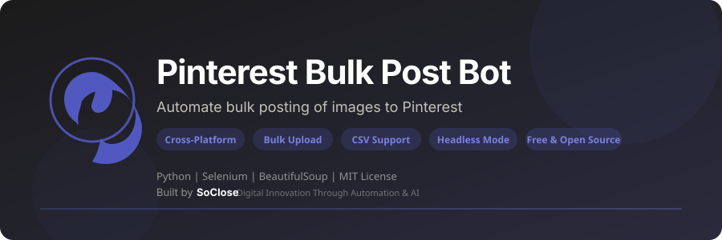

<p align="center">
  
</p>

<p align="center">
  <strong>Automate bulk posting of images to Pinterest - Upload hundreds of pins in minutes instead of hours.</strong>
</p>

<p align="center">
  <a href="LICENSE"></a>
  <a href="https://www.python.org/downloads/"></a>
  
  <a href="https://www.selenium.dev/"></a>
  <a href="https://github.com/Aymen07171/pinterest-bulk-post-bot/stargazers"></a>
  <a href="https://github.com/Aymen07171/pinterest-bulk-post-bot/issues"></a>
  <a href="https://github.com/Aymen07171/pinterest-bulk-post-bot/network/members"></a>
</p>

<p align="center">
  <a href="#quick-start">Quick Start</a> &bull;
  <a href="#key-features">Features</a> &bull;
  <a href="#configuration">Configuration</a> &bull;
  <a href="#faq">FAQ</a> &bull;
  <a href="#contributing">Contributing</a>
</p>

---

## What is Pinterest Bulk Post Bot?

**Pinterest Bulk Post Bot** is a free, open-source **Pinterest automation tool** built with Python and Selenium. It lets you **bulk upload images to Pinterest** directly from your computer. Instead of manually creating pins one by one, this bot automates the entire process: uploading images, filling in titles, descriptions, destination links, and selecting boards - all in one go.

Whether you need to post 10 pins or 1000, this **Pinterest pin scheduler** handles it automatically while you focus on what matters.

### Who is this for?

- **Pinterest Marketers** looking to scale their pinning strategy
- **Bloggers** who want to drive traffic from Pinterest to their blog posts
- **E-commerce Sellers** promoting products on Pinterest at scale
- **Social Media Managers** handling multiple Pinterest accounts
- **Affiliate Marketers** bulk-posting promotional pins
- **Content Creators** who want to save hours of manual work

### Key Features

- **Bulk Upload** - Post dozens or hundreds of pins in one session
- **Cross-Platform** - Works on Windows, macOS, and Linux
- **Per-Image Metadata** - Use a CSV file to set unique title, description, link, and board for each pin
- **Google Sheets Queue** - Read product rows, mockups, keywords, and boards from a central sheet and write publishing results back
- **Configurable** - JSON config file for persistent settings
- **Smart Waits** - Uses intelligent waits instead of fixed delays for reliability
- **Progress Tracking** - Real-time progress bar and logging
- **Error Recovery** - Continues posting even if individual pins fail
- **CLI Arguments** - Full command-line interface with options
- **Headless Mode** - Run without a visible browser window
- **Free & Open Source** - MIT license; Pinterest API key not required

---

## Quick Start

### Prerequisites

| Requirement | Details |
|-------------|---------|
| **Python** | Version 3.8 or higher ([Download](https://www.python.org/downloads/)) |
| **Google Chrome** | Latest version ([Download](https://www.google.com/chrome/)) |
| **Pinterest Account** | A valid Pinterest account |

### Installation

```bash
# 1. Clone your repository (replace YOUR_GITHUB_USERNAME)
git clone https://github.com/YOUR_GITHUB_USERNAME/pinterest-bulk-post-bot.git
cd pinterest-bulk-post-bot

# 2. (Recommended) Create a virtual environment
python -m venv venv

# Activate it:
# Windows:
venv\Scripts\activate
# macOS / Linux:
source venv/bin/activate

# 3. Install dependencies
pip install -r requirements.txt
```

### Usage

#### Basic Usage (same metadata for all pins)

```bash
python main.py
```

The bot will:
1. Open Chrome and navigate to Pinterest login
2. On first run, wait for you to log in manually; the dedicated bot Chrome profile saves that session for later runs
3. Ask you for a title, description, link, and board name
4. Upload all images from the `bulk_post_pinterest/` folder

#### Advanced Usage (per-image metadata with CSV)

```bash
python main.py --csv pins.csv
```

#### Google Sheets Bulk Publishing

The Google Sheet configured in `config.json` is the product database. Select several products by setting their `Status` to `Ready`, entering `TRUE` in the `Publish` column (or formatting those cells as checkboxes), or specifying their sheet row numbers:

```bash
python main.py --sheets
python main.py --sheets --rows 2,5,8
python main.py --sheets --retry-failed
python main.py --sheets --rows 2 --dry-run
python main.py --sheets --confirm-bulk
```

The bot reads each selected row, downloads that row's mockup, validates the title (100 characters maximum), description (500 characters maximum), destination URL, image, and board, then uses Pinterest's browser Pin builder. It clicks **Publish** and records success only after Pinterest confirms publication or opens the new Pin. A row with `Published`, a saved Pin ID, or a saved Pin URL is skipped. `Processing` rows are also skipped after an interrupted or unconfirmed publish so you can check Pinterest before retrying.

By default, each run processes at most one Pin. Use `--dry-run` to check the Sheet data and download the mockup without opening Pinterest or changing row statuses. After verifying the one-Pin result, `--confirm-bulk` allows all selected rows to run in one session. Product-level destination URLs take precedence; otherwise `google_sheets.default_destination_url` is used.

#### Pinterest's native bulk CSV upload

For the native Pinterest bulk importer, export selected Sheet rows in Pinterest's supported CSV format:

```powershell
python main.py --sheets --retry-failed --board "Phone Cases" --export-pinterest-csv
```

The CSV contains `Title`, `Media URL`, `Pinterest board`, `Thumbnail`, `Description`, `Link`, `Publish date`, and `Keywords`. It exports all selected rows and splits files at Pinterest's 200-Pin limit. The mockup URL must be publicly fetchable; the exporter checks this before writing the CSV. Pinterest requires a business account for CSV bulk import. Upload the file on desktop through **Settings → Import content → Upload .csv or .txt file**. An empty `Publish date` means publish immediately after import.

The Sheet status changes to `CSV Exported` when the file is created, and the `Publish` checkbox is cleared to prevent accidental re-export. This status does not mean Pinterest published the Pins. After Pinterest confirms the import, update the rows to `Published` and add their Pin URLs/IDs if you want those details tracked in the Sheet; Pinterest's CSV importer does not return those details to this bot.

#### All CLI Options

```bash
python main.py --help
```

| Option | Description | Default |
|--------|-------------|---------|
| `--config FILE` | Path to JSON config file | `config.json` |
| `--csv FILE` | Path to CSV file with per-image metadata | None |
| `--headless` | Run Chrome without visible window | Off |
| `--board NAME` | Pinterest board name to post to | (interactive) |
| `--images FOLDER` | Path to folder containing images | `bulk_post_pinterest/` |
| `--sheets` | Read selected product rows from the configured Google Sheet | Off |
| `--rows 2,5` | Publish specific 1-based data row numbers; requires `--sheets` | None |
| `--retry-failed` | Include rows with `Failed` or `Retry Required` status; requires `--sheets` | Off |
| `--confirm-bulk` | Allow more than one selected row after the one-Pin trial | Off |
| `--dry-run` | Validate row content and download mockups without opening Pinterest | Off |
| `--export-pinterest-csv [FILE]` | Export selected Sheet rows to Pinterest's native bulk CSV; requires `--sheets` | `exports/pinterest_bulk_upload.csv` |

#### Examples

```bash
# Post all images to "My Recipes" board
python main.py --board "My Recipes"

# Use a CSV for unique metadata per pin
python main.py --csv my_pins.csv --board "Travel"

# Run in background (headless) with custom image folder
python main.py --headless --images ./my_photos --board "Photography"

# Use a custom config file
python main.py --config my_config.json

# Publish selected Google Sheet products
python main.py --sheets
```

---

## Configuration

### Google Sheets Setup

Copy `config.example.json` to `config.json`, then enter your spreadsheet ID and worksheet tab ID. The local `config.json` and Google service-account key are excluded from Git. The sheet is private, so the bot uses a Google service account to read rows and update statuses:

1. In Google Cloud, create a service account and download its JSON key. Enable the Google Sheets API; enable the Google Drive API too if mockups are stored in Drive.
2. Put the key at `credentials/google-service-account.json` (or change `google_sheets.service_account_file` in `config.json`). The `credentials/` folder is ignored by Git.
3. Share the spreadsheet with the service account's `client_email` as an **Editor**, since the bot writes status and Pin details back. If images are in Drive, share their files or containing folder with the same account as a viewer.
4. Install the dependencies and run `python main.py --sheets`.

Google's [service-account guide](https://developers.google.com/identity/protocols/oauth2/service-account) explains how to create the credentials. The bot uses the [Sheets values API](https://developers.google.com/workspace/sheets/api/guides/values) to read product rows and write results.

The first run adds missing `Publish`, `Status`, `Pinterest Pin ID`, `Pinterest Pin URL`, `Publish Error`, `Updated At`, `Published At`, `Final Published Title`, `Final Published Description`, and `Pinterest CSV Exported At` columns. Empty statuses become `Not Published`. Set `Status` to `Ready` to publish a row the next time the bot runs, or set `Publish` to `TRUE` for a one-time selection. After validation, browser-published rows are marked `Processing` and then `Published` when confirmed. Native CSV exports change rows to `CSV Exported`; this records file creation and must not be treated as Pinterest publication. Input or Pinterest errors are retained in `Publish Error` and marked `Failed` or `Retry Required`. A row with `Status` set to `Scheduled` is published after its `Scheduled At`/`Publish At` date is due and the bot runs again; use ISO date/time such as `2026-10-01 09:30` to avoid locale ambiguity. Use Windows Task Scheduler if the bot should check the sheet on a recurring schedule.

The bot recognizes common headers such as `Product Title`, `Mockup Image`, `Keywords`, `Product Description`, `Listing URL`, `Category`, and `Pinterest Board`. Image cells can contain a local file path, a direct image URL, a Google Drive file link, or an `=IMAGE("url")` formula. If your headers differ, map them in `google_sheets.column_map`, for example:

```json
"column_map": {
  "title": "Design Name",
  "image": "Mockup File URL",
  "keywords": "SEO Tags",
  "description": "Listing Copy",
  "url": "Etsy Listing",
  "board": "Pinterest Board Name"
}
```

Use `google_sheets.category_boards` to map sheet categories to Pinterest board names, and `google_sheets.description_fields` to include additional columns in the generated description. Product details stay in the sheet; configuration contains only the sheet location, column mapping, authentication path, and category-to-board rules.

### Config File (`config.json`)

Copy `config.example.json` to `config.json` in the project root, then edit the local file:

```json
{
    "board_name": "My Board",
    "login_wait_seconds": 120,
    "delay_between_pins": 2,
    "images_folder": "bulk_post_pinterest",
    "headless": false,
    "chrome_profile_dir": ""
}
```

| Field | Type | Description |
|-------|------|-------------|
| `board_name` | string | Default Pinterest board name |
| `login_wait_seconds` | number | Seconds to wait for manual login |
| `delay_between_pins` | number | Seconds to wait between each pin |
| `images_folder` | string | Folder containing images to upload |
| `headless` | boolean | Run Chrome without visible window |

| `chrome_profile_dir` | string | Optional persistent Chrome profile path; blank uses the bot profile under the user local app data directory |

The bot profile stores the Pinterest login session. Keep it on the same computer and do not share it. The first successful login creates it; later runs reuse it while Pinterest accepts that session.

### CSV File for Per-Image Metadata

Create a CSV file with unique title, description, link, and board for each pin:

```csv
filename,title,description,link,board
photo1.jpg,Beautiful Sunset,A stunning sunset over the ocean,https://myblog.com/sunset,Travel
photo2.png,Recipe Card,Easy pasta recipe in 30 minutes,https://myblog.com/pasta,Recipes
```

| Column | Required | Description |
|--------|----------|-------------|
| `filename` | Yes | Image filename (must match file in images folder) |
| `title` | Yes | Pin title |
| `description` | Yes | Pin description |
| `link` | No | Destination URL for the pin |
| `board` | No | Board name (overrides default) |

See [pins_example.csv](pins_example.csv) for a ready-to-use template.

---

## Supported Image Formats

| Format | Extension |
|--------|-----------|
| JPEG | `.jpg`, `.jpeg` |
| PNG | `.png` |
| GIF | `.gif` |
| WebP | `.webp` |
| BMP | `.bmp` |
| TIFF | `.tiff` |

---

## Project Structure

```
PinterestBulkPostBot/
├── main.py                 # Main bot script
├── config.example.json    # Safe configuration template; copy to config.json
├── pins_example.csv        # Example CSV for per-image metadata
├── requirements.txt        # Python dependencies
├── bulk_post_pinterest/    # Default folder for images to upload
│   └── (your images here)
├── assets/
│   └── banner.svg          # Project banner
├── LICENSE                 # MIT License
├── README.md               # This file
├── CONTRIBUTING.md         # Contribution guidelines
└── .gitignore              # Git ignore rules
```

---

## Troubleshooting

### Chrome driver issues

The bot uses `webdriver-manager` to automatically download the correct ChromeDriver version. If you encounter issues:

```bash
pip install --upgrade webdriver-manager
```

### Login timeout

If 120 seconds isn't enough to log in, increase the timeout in `config.json`:

```json
{
    "login_wait_seconds": 120
}
```

### Pinterest UI changes

Pinterest occasionally updates its web interface. If the bot stops working:
1. Check the [Issues](https://github.com/SoCloseSociety/PinterestBulkPostBot/issues) page for known problems
2. Open a new issue with the error message

### Permission denied errors (macOS/Linux)

```bash
chmod +x main.py
```

---

## FAQ

**Q: Is this free?**
A: Yes. Pinterest Bulk Post Bot is 100% free and open source under the MIT license.

**Q: Do I need a Pinterest API key?**
A: No. This tool uses browser automation (Selenium), so no API key or developer account is needed.

**Q: How many pins can I post at once?**
A: There is no hard limit. The bot posts pins one by one, so you can upload as many images as you have in your folder. Just be mindful of Pinterest's usage policies.

**Q: Does it work with Pinterest business accounts?**
A: Yes. It works with both personal and business Pinterest accounts.

**Q: Can I set different titles and descriptions for each pin?**
A: Yes! Use the `--csv` option with a CSV file to provide unique metadata for each image. See [Configuration](#csv-file-for-per-image-metadata).

**Q: Does it work on Mac / Linux?**
A: Yes. The bot is fully cross-platform and works on Windows, macOS, and Linux.

**Q: Can I run it without opening a browser window?**
A: Yes. Use `--headless` mode: `python main.py --headless`

---

## Demo

A demo video (`watch_me.mp4`) is included in the repository. Clone the project and watch it locally to see the bot in action.

---

## Alternatives Comparison

| Feature | Pinterest Bulk Post Bot | Manual Posting | Tailwind | Buffer |
|---------|------------------------|----------------|----------|--------|
| Price | **Free** | Free | $14.99/mo | $15/mo |
| Bulk upload | Yes | No | Limited | Limited |
| Custom metadata per pin | Yes (CSV) | Yes | Yes | Yes |
| Open source | Yes | N/A | No | No |
| API key required | No | No | Yes | Yes |
| Cross-platform | Yes | Yes | Web only | Web only |
| Headless mode | Yes | N/A | N/A | N/A |

---

## Contributing

Contributions are welcome! Please read the [Contributing Guide](CONTRIBUTING.md) before submitting a pull request.

---

## License

This project is licensed under the [MIT License](LICENSE).

---

## Disclaimer

This tool is provided for **educational and personal productivity purposes only**. Use it responsibly and in compliance with [Pinterest's Terms of Service](https://policy.pinterest.com/en/terms-of-service). The authors are not responsible for any misuse or consequences arising from the use of this software.

---

<p align="center">
  <strong>If this project helps you, please give it a star!</strong><br>
  It helps others discover this tool.<br><br>
  <a href="https://github.com/SoCloseSociety/PinterestBulkPostBot">
    
  </a>
</p>

<br>

<p align="center">
  <sub>Built with purpose by <a href="https://soclose.co"><strong>SoClose</strong></a> &mdash; Digital Innovation Through Automation & AI</sub><br>
  <sub>
    <a href="https://soclose.co">Website</a> &bull;
    <a href="https://linkedin.com/company/soclose-agency">LinkedIn</a> &bull;
    <a href="https://twitter.com/SoCloseAgency">Twitter</a> &bull;
    <a href="mailto:hello@soclose.co">Contact</a>
  </sub>
</p>
